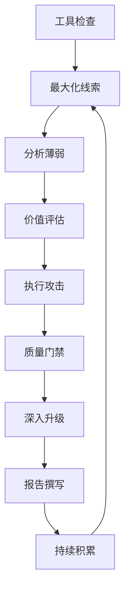

# SRC工作方法论

## 八步流程

## 第零步：工具检查

每次任务前必做：外网→代理→登录态→浏览器CDP→安全工具→项目文件

详见 → [[工具设备检查清单]]

## 第一步：最大化线索

四层攻击面拆解：
- 域名层：主域名/子域名/旁站/C段
- 应用层：Web/API/客户端/小程序
- 数据层：用户数据/业务数据/配置文件
- 基础设施层：CDN/云服务/IP/容器/监控

详见 → [[朴朴复用策略]]

## 第二步：分析薄弱

按安全级别分层：C端API（最弱）→ 供应商端 → 管理端 → 主站

## 第三步：价值评估

优先级：认证绕过 > IDOR > 业务逻辑 > 信息泄露

查 [[永不提交清单]] 和 [[链式组合表]]

## 第四步：执行攻击

20分钟轮换 + A→B信号 + Error-based优先

## 第五步：质量门禁

7-Question Gate + 永不提交清单 + 多工具复现

## 第六步：深入升级

低危→高危链式组合 + 兄弟漏洞 + 逆向修复

## 第七步：报告撰写

影响先行 + 可复制请求 + CVSS + 修复建议

## 第八步：持续积累

[[攻击记忆库]] + 失败样本 + 项目记录 + 复用策略

## 外部学习来源

- [[Claude-BugHunter]] — 51个技能，7Q Gate
- [[DeepAudit]] — 攻击记忆系统
- [[Shannon]] — 浏览器自动化exploit
- [[SRC工作方法论v2]]

## 核心认知

1. 线索是最重要的资产
2. 薄弱环节不是随机的——大公司多端分裂是系统性问题
3. 漏洞的价值是相对的——单独低危，链接后可能高危
4. 时间是最稀缺的资源——20分钟规则防止死磕
5. 经验必须可复用——每次实战更新记忆库和复用策略
6. 工具不好使就换工具——不换目标，不换任务
7. 永远有下一步——被拒一个发现≠停止整个作业
8. **方法论是活的，不是硬道理**——一次实践的结论可能被下次实战推翻。每次用完都要回来修正。学习是不断的打破和迭代
